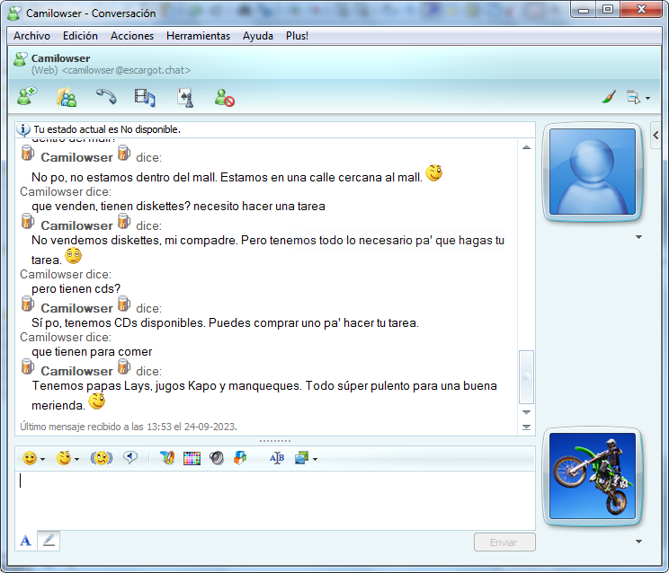

# Msn Chatbot

Connect MSN Messenger (AKA. Windows Live Messenger) 8.5 to ChatGPT for your own nostalgia shot.

This chatbot is configured to act as a cibercafe administrator in the year 2007 in Chile.

## Installation

- Install _MSNChatbot.plsc_ to Messenger Plus scripts.
- Set `OPENAI_API_KEY` env.
- Install deps `mix deps.get`
- Run `iex -S mix run --no-halt`

- Create an account in https://escargot.chat/ and use a patched MSN Messenger client to use.
- Configure `lib/prelude.ex` with your own settings.

## How?

This bot uses the [Messenger Plus 4.83](https://escargot.chat/download/msn/extras/) scripts to trigger events. Calls `localhost:3000` with the params and the server calls _OpenAI_ for the response.

This is a limited approach, a better approach would be creating a whole client using some libs like https://github.com/RayTF/MSNPSharp but since this was just a fun experiment I will leave that job to others.

## Why?

Because is fun to see old technology working again, and with some powerups like ChatGPT.

## Credits

A Chatbot that connects with ChatGPT using Messenger PLUS! as a bridge for MSN Messenger 8.5. Created in 2023 by Camilo Castro. Elixir Chile https://elixircl.github.io

