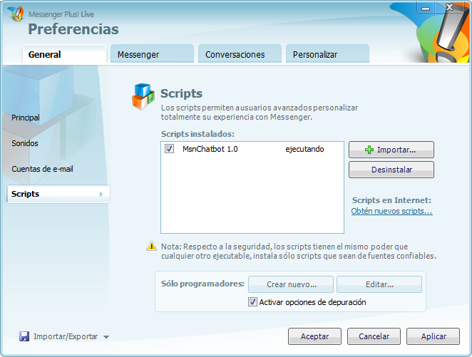

# MPLScripting

Creating scripts for MSNPlus is quite simple. Is practically Javascript from 2008.

I found some docs that you can download in chm or html format.

- **plsc** format is just a zip file that contains a js and ScriptInfo.xml file.

Install using the MSNPlus script tab.

- [List of MSNPlus Scripts](https://wiki.nina.chat/wiki/Clients/Windows_Live_Messenger/Messenger_Plus!)

## Dependencies

- Elixir 1.14
- Erlang OTP 24
- Windows 7
- WLM 8.5
- Messenger Plus! 4.83 (Plus! Live)
- https://escargot.chat/